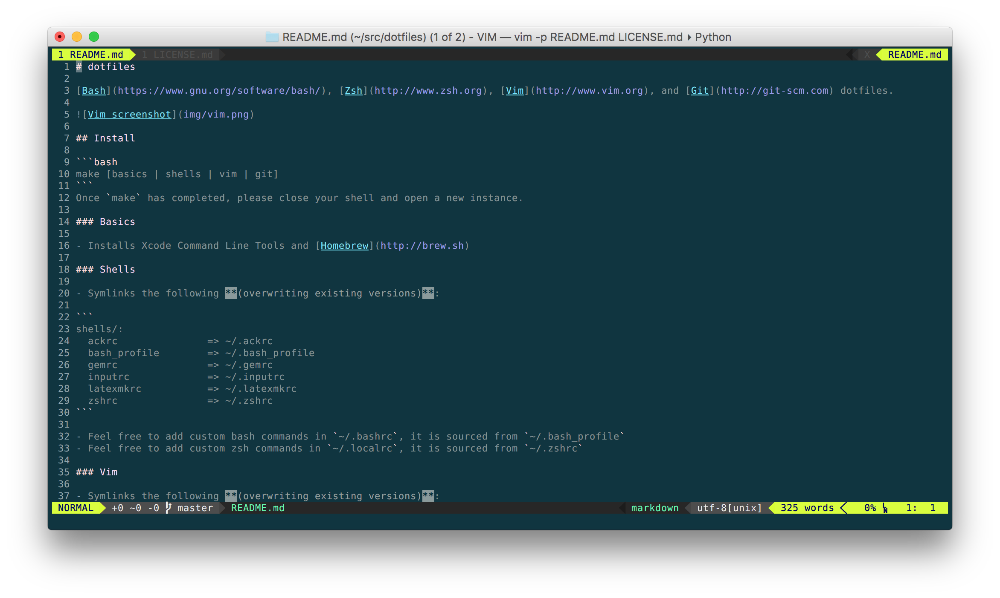

# dotfiles

Bash, Vim, and Git dotfiles.



## Install

```bash
make
```

- **WARNING**: The following files/folders will be symlinked into your home directory **(replacing any existing versions)**:
```
shells/:
  ackrc               => ~/.ackrc
  bash_profile        => ~/.bash_profile
  inputrc             => ~/.inputrc
vim/:
  vim/                => ~/.vim
  vimrc               => ~/.vimrc
  gvimrc              => ~/.gvimrc
git/:
  gitconfig           => ~/.gitconfig
  gitignore_global    => ~/.gitignore_global
```

- Vundle.vim plugin manager and all Vim plugins in `.vimrc` will be installed

- Meslo for Powerline (a patched font for symbols on the Vim statusline) will be installed
    - Font installs may require you to log out and log back in to take effect

- You will be prompted to complete `~/.gitconfig_user`

- Feel free to add custom bash commands in `~/.bashrc`, it is sourced from `~/.bash_profile`

Once `make` has completed, please close your shell and open a new instance.

## Load Custom [iTerm](http://iterm2.com) Preferences

Launch [iTerm](http://iterm2.com), check and set "Preferences > General > Load preferences from a custom folder or URL" to this repository.

## Install Vim Autocomplete ([YouCompleteMe](http://valloric.github.io/YouCompleteMe/))

```bash
make vimcompletion
```

## Uninstall

```bash
make uninstall
```
